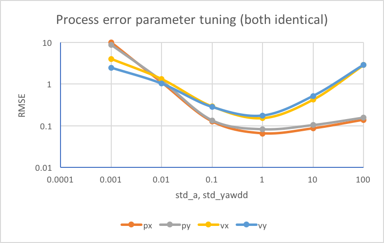
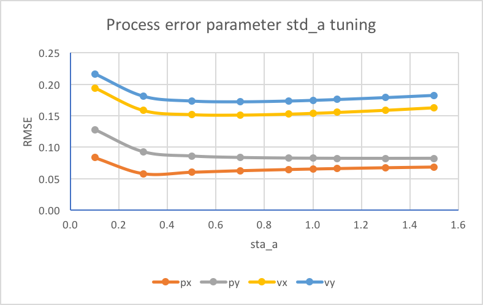
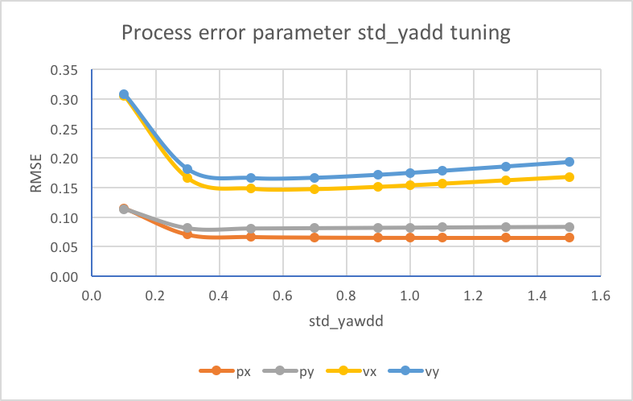
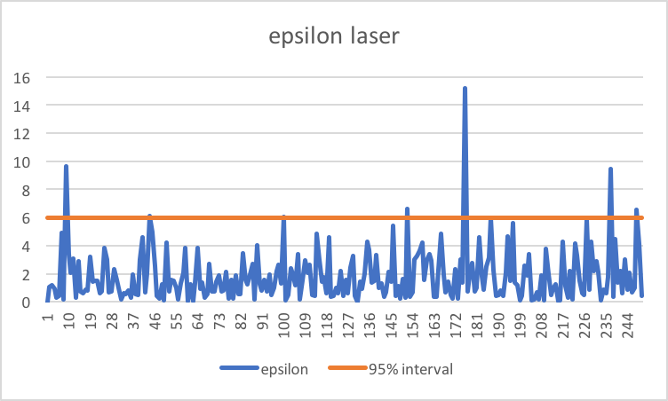
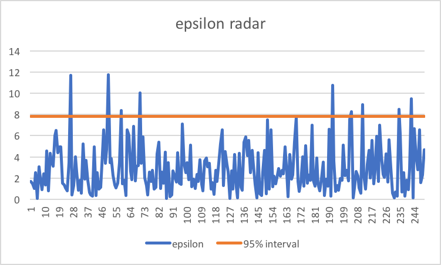

# Unscented Kalman Filter
**Igor Passchier**

igor.passchier@tassinternational.com

## Introduction
This is the project submission of the project on Unscented Kalman Filters. The remainder of this readme follows the project [rubric](https://review.udacity.com/#!/rubrics/783/view), and finishing with some additions.

## Compiling
The project is based on the starter code provided. The CMakelists.txt has been extended to include the additional source files, but the structure is unchanged. The code should compile on any system, but has been checked on MacOS with command line tools and with XCode.

To build and run:
1. mkdir build
2. cd build
3. cmake ..
4. make
5. ./UnscentedKF

## Accuracy
The project has been developed and tested with the "obj_pose-laser-radar-synthetic-input.txt", and should have RMSE values less than  [.09, .10, .40, .30].
The final RMSE values obtained are [0.062	0.086	0.147	0.164], so meeting the criteria.

## Following the correct algorithm
### Follow the algoritmn process
The overall process flow is handled in [main.cpp](src/main.cpp) line 236. If a command line option is provided, the main routine will read the sensordata and ground truth data directly from the input file (line 122), while if no command line option is provided, than the input from the simulator is expected (line 147). In this way, visual feedback can be provided via the simulator, while parameter tuning can be done much faster with the direct input. Processing the sensor input is done on line 35, and when the input line is processed, the actual filter is called on line 88.

All process state variables are stored in a new class State, implemented in [state.cpp](src/state.cpp).

Relevant output is written to datafiles for further processing, and RMSE values are directly provided on standard out.

The UKF algorithm is implemented in [ukf.cpp](src/ukf.cpp). The full process flow is implemented in the function ProcessMeasurement, on lin e 95. 

### Handle the first measurement appropriately
The UKF is initilized to a large extend statically in the constructor, line 13. The state vector is initialized with zeros, except for v, because they can all have symmetric values around 0. The velocity is expected to be larger than 0, as we expected a driving bicycle. 5 m/s is a realistic value for a bicycle.

The covariance matrix is initialized with realistic values, see line 28. Note, that the first 2 diagonal ellements will be updated on receiving the first measurement.

The lambda and the weights are initialized with the proposed values, see line 41 and further. The process noise parameters std_a and std_yawdd have been optimized, see later. The laser and radar correlation matrices are based on the provided standard deviations, see line 73 and further.

On receiving the first measurmeent, the Initilize function is called to initialize the UKF with the first measurement data, line 119. Depending on the sensor type, state x and y are initialized. Also P(0,0) and P(1,1) are initialized based on the accuracy of the sensor.

### First predict, then update
If the filter is already initialized, then the Prediction function is called on line 107. This function generated the Augmented sigma points and predicts the values based on the timestep. For limiting angles and angle differences to -pi -- pi, a new function has been added to [tools.cpp](src/tools.cpp). This is used throughout the code to prevent incorrect ranges.

Starting at line 109, the update functions are called for Radar otr Lidar data, where it is also checked whether the data is to be ignored. Both are almost identical, except that they implement different sensor models. The sigma points resulting from the prediction step are reused for the update step. The functions follow exactly the process described in the lessons.

As a last step, also the NIS values are calculated, see e.g. line 257.

### Handle laser and radar measurements
See the functions UpdateLidar (line 188) and UpdateRadar (line 264).

## Code efficiency
The code has been developed efficiently, without too many classes. Debugging features could be improved, as now a lot of print statements are included and commented out as needed. Parameters could be read from either a config file or the command line, which would have made parameter tuning a bit more efficient, but was in this case not worth the coding effort.

## Additional work
The steps below have been done in an excell sheet, see [here](analysis/tuning.xslx). Also, all figures are stored in the [analysis](analysis) directory.

### Parameter tuning
The 2 process noise parameters have been tuned to find the optimum balance between relying on the new measurements or on the historical data and the motion model. Normally, also the sensor noise parameters would influence this, but these had to be kept constant. These could have been verified/optimized based on the ground truth data.

The tuning has been done in 2 steps.
1. both parameters are expected to be numarically of the same order of magnitude, and therefore a scan has been made with "logaritmic" steps and the RMSE values are minimized. See figure below

From this, it is clear that the optimum for both parameters is about 1. 

2. Around these optima, I have further tuned both parameters individually, see the 2 figures below.

From these scans, I determined the optimum values, std_a = 0.4 (m/s^2), and std_yawdd=0.4 (rad/s^2).

### Reliability check.
To see whether the predictions are reliable and the sensor predictions realistic, I have calculated the NIS values and compared them with the 95% interval values for 2 (lidar) and 3 (radar) independent measurements.

These figures show a few peaks above the 95% interval limit. In bulk, this looks reasonable, although a bit more peaks above the limit would be expected. Probably, the radar and lidar data are a bit more accurate than suggested by the provided standard deviations.

